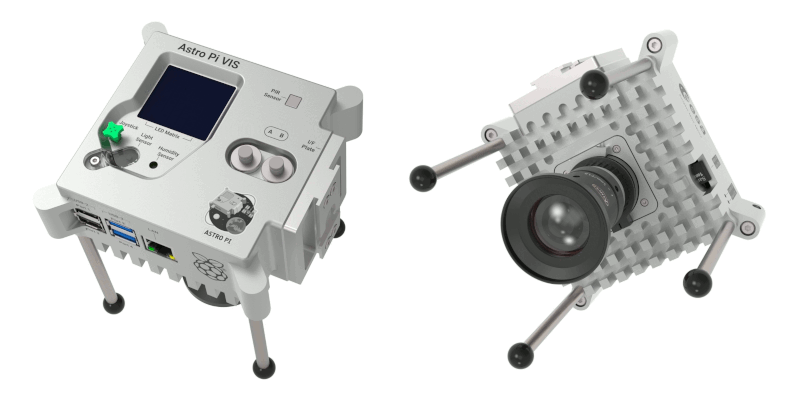

# Introduction
In Mission Space Lab your task is to write a Python program that will gather and log data using an Astro Pi on board the International Space Station (ISS). The Astro Pi is equipped with a host of different sensors and a camera, allowing you to conduct your own scientific investigations and experiments!

This is not a complete step-by-step guide on how to create your program. You and your team will need to make decisions about what you want your code to do and work out how to implement them.

Head over to the [Astro Pi website](https://astro-pi.org/mission-space-lab/) for more information about Mission Space Lab.

Answers to many of the questions that arise can probably be found by searching online, and we encourage you to do some research and try out different solutions if you get stuck. We will also be running two livestreams where you can ask questions to the Astro Pi Mission Control team. 

If you get stuck, please [contact us](mailto:enquiries@astro-pi.org) and we will do our best to help you!

  

## What you are going to make

Your task is to write a Python program that will run autonomously for 10 minutes aboard the ISS. During this time, your program must gather data from the Astro Pi's sensors or camera and record this information directly to a data file. You can also use your allocated time to run a more complex program, take photos of the Earth, or conduct a scientific experiment - the choice is yours!

Your code must meet a baseline set of criteria to pass the strict checking process run by Astro Pi Mission Control. If you pass then you will achieve official **flight status** and have your program run aboard the ISS. If your code causes errors or fails to comply with these core operational requirements, it will not run on the ISS. 

We provide information on how to write a program that satisfies these requirements, how to improve your program to make sure it runs smoothly on the ISS while also following the security rules later in this guide. 

## What you will need

To complete this project, you will need:

- **A computer running Python 3.11 or above.** You can use any Microsoft Windows, macOS, or Linux computer. You can find [instructions for installing Python here](https://projects.raspberrypi.org/en/projects/generic-python-install-python3). A full description of the Python requirements for Mission Space Lab appears later in this guide.
- **An internet connection.** You will need to access the internet to use the [Astro Pi Replay Tool](https://rpf.io/replay) to simulate your code running live on the Astro Pis on the ISS. You will also need internet access to submit your program.
- **A code editor.** This is where you will write and edit your Python code. Any text editor will work, but we recommend using a dedicated code editor like Thonny. In this guide, we will be using instructions for Thonny.

## What could you investigate? 

The Astro Pi computers offer lots of possibilities for different science projects. To illustrate what's possible, here are a few selected examples of projects that Mission Space Lab teams designed in the past: 

- [Analysing vegetation using NDVI analysis and image stitching](https://esamultimedia.esa.int/docs/edu/aretusa.pdf)
- [Identifying seaweed rafts in the Oceans](https://esamultimedia.esa.int/docs/edu/stmarks.pdf)
- [Measuring the Earth's magenetic field](https://esamultimedia.esa.int/docs/edu/dahspace.pdf)
- [Analysing cloud types](https://esamultimedia.esa.int/docs/edu/t5clouds.pdf)

Please note: These projects had a program run time of 3 hours. Your program must run within 10 minutes. 
