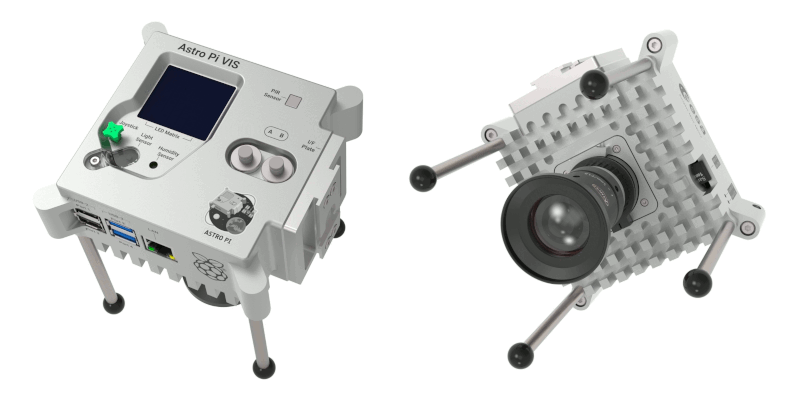

## Introduction
This guide is designed to help you and your team create your program for Mission Space Lab 2023/24. In this Mission, your task is to create a program that will gather data using an Astro Pi computer's sensors and camera and use this data to calculate the speed at which the International Space Station (ISS) is travelling. We will provide you with lots of supporting materials to help you write and develop your program, including an example project using historical photos. We will also help you to adapt and test your program so that it can run for 10 minutes on board the ISS and produce a value for the speed of the ISS, in real time.

This is not a complete step-by-step guide on how to create a program that will solve the problem posed in this Mission. You and your team will need to come up with ideas and solutions and work out how to implement them.

Don't know about Mission Space Lab? Don't worry! Head over to the [Astro Pi website](https://astro-pi.org/mission-space-lab/) for more information.

Answers to many of the questions that arise can probably be found by searching online, and we encourage you to do some research and try out different solutions if you get stuck. We will also be running a couple of scheduled online webinars where you can ask questions of the team at Astro Pi Mission Control, or you can email us at [enquiries@astro-pi.org](mailto:enquiries@astro-pi.org). Don't hesitate to contact us — we would love to hear from you.

There are a wealth of resources available to help you succeed at every stage of your Astro Pi journey.

If you get stuck, please [contact us](mailto:enquiries@astro-pi.org) and we will do our best to help you!

  

### What you will need to make

Your task is to design a program that will run for 10 minutes aboard the ISS, and in that time, gather data and use it to estimate the speed of the ISS. At the end of the 10 minutes, your program must have written a file containing your estimate for the speed of the ISS in kilometres per second.

You can use our Astro Pi Replay plug-in to simulate your code running live on the Astro Pis on the ISS, to test that your program will work in real time.

We will also give you information on how to improve your program to make sure it runs smoothly on the ISS while also following the security rules.

### What you will need

To complete this project, you will need:
- **A computer running Python 3.9.2 or above.** You can use any Microsoft Windows, macOS, or Linux computer. You can find [instructions for installing Python here](https://projects.raspberrypi.org/en/projects/generic-python-install-python3). A full description of the Python requirements for Mission Space Lab appears later in this guide.
- **Thonny integrated development environment (IDE).** We recommend you use Thonny, as it is easy to use, and it is available for Microsoft Windows, macOS, Linux, and Raspberry Pi OS operating systems. You can find [instructions for installing Thonny here](https://thonny.org/).
- **An internet connection.** You will need to access the internet to install the Python packages and to use the Astro Pi Replay plug-in, and to submit your program.
