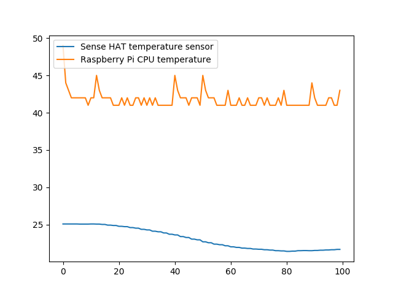

## The Astro Pi computers

The Astro Pis aboard the ISS are two modified Raspberry Pi 4 8GB computers, kitted out with a Sense HAT add-on board and camera, and packed into a custom aluminium flight case. The Sense HAT (V2) includes sensors such as temperature, humidity, gyroscope, magnetometer, accelerometer, and light/colour sensors, allowing you to measure things like the local magnetic field and acceleration. The computers are equipped with a powerful Raspberry Pi High Quality Camera with a 5mm lens that can take amazing pictures of the Earth. You can [find out more about the computers and sensors here](https://astro-pi.org/about/the-computers).


With an understanding of what the available sensors on the Astro Pis can do, think creatively about how to use them to find the speed of the ISS. Don't worry about getting everything perfect at first. Try to think of different ways, even if they seem unusual. Either by yourself or as a team, how many ways can you think of to calculate the speed using these tools?

--- task ---

Come up with several different ways of calculating the speed of the ISS using the Astro Pi hardware. Be creative, and try to think out of the box. Once you have a few options, discuss them as a team and choose the one you think will give the most accurate result.

--- /task --- 

In the next section, you will learn about the different Python libraries available that can help you with your project, and also about some that you cannot use for security reasons. You do not have to use all of the Python libraries in this section, only the ones that you decide to use in your program to help it perform the way you want it to. 

### The Astro Pi Python environment

The Astro Pi computers on the ISS have Python version 3.11 installed, so you will need to be using this version, or higher. If you are using a higher version, be aware that there may be some new functions that work on your computer but not on the Astro Pis.

There are some restrictions on the modules (parts) of the standard library that you can use. The following modules are not allowed, and if you do use them, your program will not be accepted:

[Disallowed libraries](https://docs.google.com/spreadsheets/u/0/d/1EoVzgA8gOiDXsJ1k9dQBdPyFC8U3bXFca2dRmdKNbcI/edit)

Alongside the Python standard environment, the Astro Pis have extra libraries installed to help you complete the Mission. Each one is explained briefly below with examples. There are also links for more details if you need them. Remember to bookmark this page for later!


--- collapse ---
---
title: Skyfield
---

#### Usage

Skyfield is an astronomy package that computes the positions of stars, planets, and satellites in orbit around the Earth.

For example, you can use Skyfield to calculate the current position of Mars:

```python
from skyfield.api import Loader
from pathlib import Path

bsp_file = Path.home() / "de421.bsp"
load = Loader(bsp_file.parent)
planets = load(bsp_file.name)
mars = planets['Mars Barycenter']
ts = load.timescale()
barycentric = mars.at(ts.now())
print(barycentric)
```

This snippet works but the ephemeris file (`de421.bsp`) is too big to submit in your final payload! To get around this, import the ephemeris from the `astro_pi_orbit` library, which will take care of importing the file for you:

```python
from skyfield.api import load
from astro_pi_orbit import de421

planets = de421
mars = planets['Mars Barycenter']
ts = load.timescale()
barycentric = mars.at(ts.now())
print(barycentric)
```

#### Documentation

- [rhodesmill.org/skyfield](https://rhodesmill.org/skyfield/)

--- /collapse ---

--- collapse ---
---
title: astro_pi_orbit
---
#### Usage

The `astro_pi_orbit` library provides The `astro_pi_orbit` library provides functionality to assist Astro Pi Mission Space Lab participants in working with orbital data. It can be used to:

1) Find the current location of the ISS
2) Access the `de421` or `de440s` ephemeris files (the files are too big to supply by yourself)
3) Access the trajectory of the ISS

#### Documentation
- [https://astro-pi.github.io/astro-pi-orbit/]

--- /collapse ---

--- collapse ---
---
title: picamzero
---

The Python library for controlling the Raspberry Pi Camera Module on the Astro Pis is `picamzero`. To get started, check out this [project guide](https://raspberrypifoundation.github.io/picamera-zero/hello_world/) for a handy walkthrough of how to use it.

#### Usage

```python
from picamzero import Camera
from time import sleep

camera = Camera()

# Take a picture every minute for 3 hours
for i in range(3*60):
    camera.take_photo(f'image_{i:03d}.jpg')
    sleep(60)
```

#### Documentation

- [https://raspberrypifoundation.github.io/picamera-zero](https://raspberrypifoundation.github.io/picamera-zero)

<p style="border-left: solid; border-width:10px; border-color: #0faeb0; background-color: aliceblue; padding: 10px;">
The picamzero library is listed in Thonny, but it won’t install on Windows or macOS because it controls Raspberry Pi hardware and relies on Linux-only components. This is expected and won't stop you from developing your experiment — you can still run your code using the Astro Pi Replay tool, either online or offline. To install picamzero on a Raspberry Pi, open the Shell in Thonny and run:
```
pip install picamzero
```
</p>

--- /collapse ---

--- collapse ---
---
title: GPIO Zero
---

GPIO Zero is a simple but powerful GPIO (General-Purpose Input/Output) library. Most of its functionality is restricted aboard the ISS — for example, the only pin you are allowed to access is GPIO pin 12, where the motion sensor is connected. However, some of its other features can be handy in your experiment, such as the internal device `CPUTemperature`.

#### Usage

Compare the Raspberry Pi's CPU temperature to the Sense HAT's temperature reading:

```python
from sense_hat import SenseHat
from gpiozero import CPUTemperature

sense = SenseHat()
cpu = CPUTemperature()

while True:
    print(f'CPU: {cpu.temperature}')
    print(f'Sense HAT: {sense.temperature}')
```

#### Documentation

- [gpiozero.readthedocs.io](https://gpiozero.readthedocs.io)

--- /collapse ---

[[[msl-numpy]]]

--- collapse ---
---
title: SciPy
---

SciPy is a free, open-source Python library used for scientific computing and technical computing. SciPy contains modules for optimisation, linear algebra, integration, interpolation, special functions, FFT (Fast Fourrier Transform), signal and image processing, ODE (Ordinary Differential Equations) solvers, and other tasks common in science and engineering. You may need to use this library to solve a particular equation.

#### Documentation

- [docs.scipy.org/doc](https://docs.scipy.org/doc/)

--- /collapse ---

--- collapse ---
---
title: pandas
---

`pandas` is an open-source library providing high-performance, easy-to-use data structures and data analysis tools.

#### Usage

```python
import pandas as pd

df = pd.read_csv("my_test_data.csv")
df.describe()
```

#### Documentation

- [pandas.pydata.org](https://pandas.pydata.org/)

--- /collapse ---

--- collapse ---
---
title: logzero
---

`logzero` is a library used to make logging easier. Logs are records of what happened while a program was running, and can be really useful for debugging.

#### Usage

Logs are categorised into different levels according to severity. By using the various levels appropriately, you will be able to tune the amount of information you get about your program according to your debugging needs.

```python
from logzero import logger

logger.debug("hello")
logger.info("info")
logger.warning("warning")
logger.error("error")
```

#### Documentation

- [logzero.readthedocs.io](https://logzero.readthedocs.io/en/latest/)

--- /collapse ---

--- collapse ---
---
title: Matplotlib
---

`matplotlib` is a 2D plotting library that produces publication-quality figures in a variety of hard copy formats and interactive environments. You may want to use it to analyse the results of your test runs.

#### Usage

```python
from sense_hat import SenseHat
from gpiozero import CPUTemperature
import matplotlib.pyplot as plt
from time import sleep

sense = SenseHat()
cpu = CPUTemperature()

st, ct = [], []
for i in range(100):
    st.append(sense.temperature)
    ct.append(cpu.temperature)
    sleep(1)

plt.plot(st)
plt.plot(ct)
plt.legend(['Sense HAT temperature sensor', 'Raspberry Pi CPU temperature'], loc='upper left')
plt.show()
```



#### Documentation

- [matplotlib.org](https://matplotlib.org/)

--- /collapse ---

--- collapse ---
---
title: Pillow
---

Pillow is an image processing library. It provides extensive file format support, an efficient internal representation, and fairly powerful image processing capabilities.

The core image library is designed for fast access to data stored in a few basic pixel formats. It should provide a solid foundation for a general image processing tool.

#### Documentation

- [pillow.readthedocs.io](https://pillow.readthedocs.io/)

--- /collapse ---

--- collapse ---
---
title: OpenCV
---

`opencv` is an open-source computer vision library. You may want to use OpenCV for [edge detection](https://projects.raspberrypi.org/en/projects/astropi-iss-speed/3), for example.

#### Documentation

- [docs.opencv.org](https://docs.opencv.org/master/)

--- /collapse ---

--- collapse ---
---
title: exif
---

`exif` allows you to read and modify image Exif metadata using Python. You may want to use it to embed GPS data into any images you take, or to [analyse photos taken aboard the ISS](https://projects.raspberrypi.org/en/projects/astropi-iss-speed/1).

#### Documentation

- [pypi.org/project/exif](https://pypi.org/project/exif/)

--- /collapse ---

--- collapse ---
---
title: scikit-learn
---

`scikit-learn` is a set of simple and efficient tools for data mining and data analysis that are accessible to everybody, and reusable in various contexts. It is designed to work with `numpy`, `scipy`, and `matplotlib`.

#### Documentation

- [scikit-learn.org](https://scikit-learn.org)

--- /collapse ---

--- collapse ---
---
title: scikit-image
---

`scikit-image` is an open-source image processing library. It includes algorithms for segmentation, geometric transformations, colour space manipulation, analysis, filtering, morphology, feature detection, and more.

#### Documentation

- [scikit-image.org](https://scikit-image.org/)

--- /collapse ---

--- collapse ---
---
title: reverse-geocoder
---

`reverse-geocoder` takes a latitude/longitude coordinate and returns the nearest town/city.

#### Usage

When used with `skyfield`, `reverse-geocoder` can determine where the ISS currently is:

```python
import reverse_geocoder
from skyfield.api import Loader
from pathlib import Path

tle_file = Path.home() / "iss.tle"
load = Loader(tle_file.parent)
if not tle_file.exists():
    load.download("http://celestrak.com/NORAD/elements/stations.txt", filename=tle_file.name)
satellites = load.tle_file(tle_file.name)
iss = satellites[0]
ts = load.timescale()

coordinates = iss.at(ts.now()).subpoint()
coordinate_pair = (
    coordinates.latitude.degrees,
    coordinates.longitude.degrees)

location = reverse_geocoder.search(coordinate_pair)
print(location)
```
This output shows that the ISS is currently over Hamilton, New York:

```
[OrderedDict([
    ('lat', '42.82701'), 
    ('lon', '-75.54462'), 
    ('name', 'Hamilton'), 
    ('admin1', 'New York'), 
    ('admin2', 'Madison County'), 
    ('cc', 'US')
])]
```

Note: The library `reverse-geocoder` can not be run using the online Replay Tool as it using multiprocessing, which is incompatible with the environment of the tool. If you wish to use this library, you will have to test the relevent sections of your code locally in your code editor, or using the Thonny plugin version of the Replay tool

#### Documentation

- [github.com/thampiman/reverse-geocoder](https://github.com/thampiman/reverse-geocoder)

--- /collapse ---

--- collapse ---
---
title: sense_hat
---
The `sense_hat` library is the main library used to collect data using the Astro Pi Sense HAT. Look at [this project guide](https://projects.raspberrypi.org/en/projects/getting-started-with-the-sense-hat) to get started. 

#### Usage

You can print the humidity using the code below:

```python
from sense_hat import SenseHat
sense = SenseHat()
print(str(sense.get_humidity()))
```

#### Documentation

- [https://sense-hat.readthedocs.io/en/latest/](https://sense-hat.readthedocs.io/en/latest/)
- [Additional documentation for the light and colour sensor](https://gist.github.com/boukeas/e46ab3558b33d2f554192a9b4265b85f)

--- /collapse ---


--- collapse ---
---
title: "ai_edge_rt"
---

The `ai_edge_litert` library allows you to run machine learning and AI inference on the Astro Pis CPUs. It is the successor library to `tflite` and `pycoral`, both of which are no longer supported by Google.

#### Usage

The example below shows how to load and execute the mobilenet v1 model:

```
from ai_edge_litert.interpreter import Interpreter
from PIL import Image

interpreter = Interpreter("mobilenet_v1_0.25_224_quant.tflite")
interpreter.allocate_tensors()

input_details = interpreter.get_input_details()
output_details = interpreter.get_output_details()

height = input_details[0]["shape"][1]
width = input_details[0]["shape"][2]
img = Image.open("black.jpg").resize((width, height))
input_data = np.expand_dims(img, axis=0)
interpreter.set_tensor(input_details[0]["index"], input_data)
interpreter.invoke()
output_data = interpreter.get_tensor(output_details[0]["index"])
print(f"tflite: {np.squeeze(output_data)}")
```
#### Documentation

- [https://ai.google.dev/edge/litert/conversion/tensorflow/pretrained_models]()
- [https://ai.google.dev/edge/litert/migration#:~:text=Because%20LiteRT%20fully%20supports%20the,migration%20guides%20for%20specific%20platforms.]()

--- /collapse ---


<p style="border-left: solid; border-width:10px; border-color: #0faeb0; background-color: aliceblue; padding: 10px;">
Because there are lots of security restrictions when running a program on board the ISS, these are the only third-party libraries that you will be allowed to use if your program runs on the Astro Pis. Please [contact us](enquiries@astro-pi.org) if you think anything is missing or have any suggestions.
</p>

### Setting up your programming environment 

We recommend using Thonny to create your program. 

[[[thonny-install]]]

To install any of the Python libraries, open Thonny and click on **Tools > Manage packages...**.

{: width="50%"}

Search for the library you want by typing its name into the search bar.


Select the correct file from the search results, then press **Install**.


If you are using a different IDE to write your code, you will need to follow local instructions for downloading the libraries you want from [PyPi](https://pypi.org/).

### Looking ahead

Now that you have set up your coding environment it's time to think about how your team is going to approach this Mission. Discuss how you will choose your method, divide up the tasks, and plan your program. Speak to your team mentor about your ideas, your progress, and any obstacles along the way. They will have lots of ideas to help you plan.
