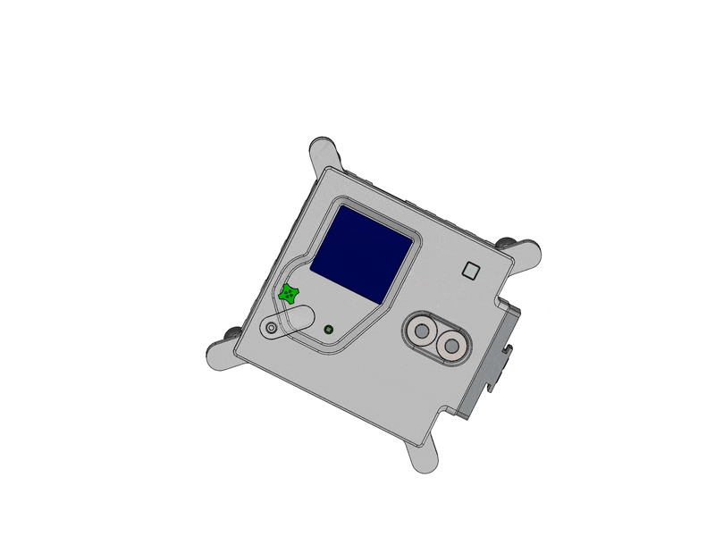
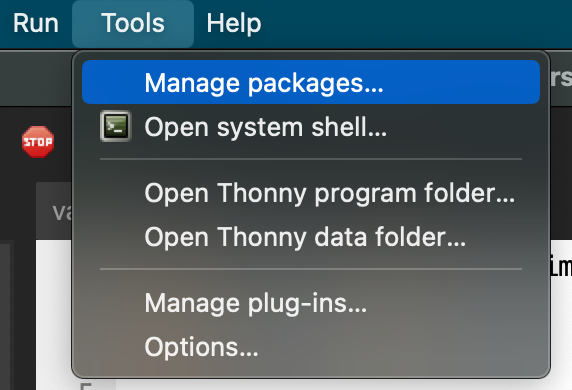
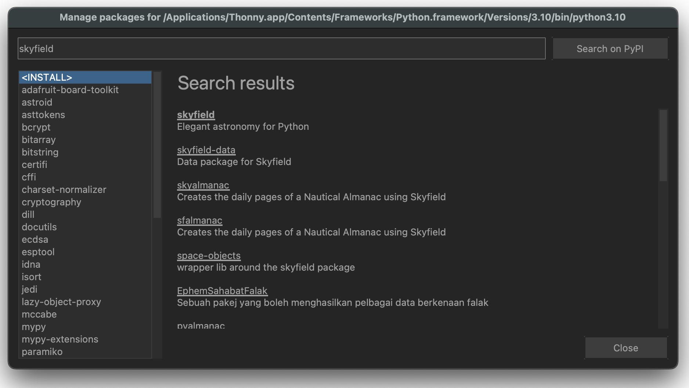
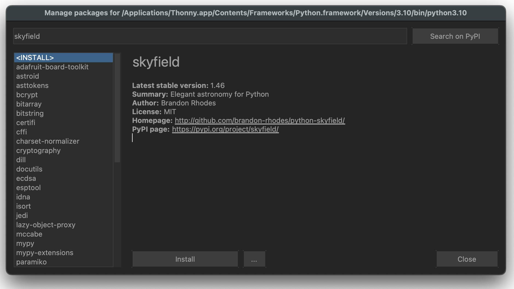

## The Astro Pi computers

The Astro Pis aboard the ISS are two modified Raspberry Pi 4 8GB computers, kitted out with extra sensors and cameras, and packed into a custom aluminium flight case. The onboard v2 Sense HAT provides temperature, humidity, gyroscope, magnetometer, and light/colour sensors, allowing you to measure things like the local magnetic field and acceleration. There is also a powerful Raspberry Pi High Quality Camera with a 5mm lens that can take amazing pictures of the Earth. Plus, these computers can do real-time machine learning thanks to the attached Coral ML accelerators.



With an understanding of what the available sensors on the Astro Pis can do, think creatively about how to use them to find the ISS speed. Don't worry about getting everything perfect at first. Try to think of different ways, even if they seem unusual. Either by yourself or as a team, how many ways can you think of to calculate the speed using these tools?

--- task ---

Come up with several different ways of calculating the speed of the ISS using the Astro Pi hardware. Be creative, and try to think out of the box. 
Once you have a few options, discuss them as a team and choose the one you think will give the most accurate result.

--- /task --- 

In the next section, you'll learn about the different Python libraries available that can help you with your project, and also about some which you can’t use for security reasons.

### The Astro Pi Python environment

The Astro Pi computers have Python version 3.9.2 installed, so you will need to be using at least this version, or greater. If you are using a higher version than this, just be aware that there may be some new functions that work on your machine but not on the Astro Pis.

There are some restrictions on the modules (parts) of the standard library that you can use. The following modules are not allowed, and if you do use them your program will not be accepted:

[Disallowed libraries](https://docs.google.com/spreadsheets/u/0/d/1EoVzgA8gOiDXsJ1k9dQBdPyFC8U3bXFca2dRmdKNbcI/edit)

Apart from the Python standard environment, the Astro Pis have extra libraries installed to help you complete the challenge. Each one is explained briefly below with examples. There are also links for more details if you need them. Don’t forget to bookmark this page for later!


--- collapse ---
---
title: Skyfield
---

#### Usage

Skyfield is an astronomy package that computes the positions of stars, planets, and satellites in orbit around the Earth.

In the [How to find the location of the ISS](6) section you can find out how to use Skyfield to obtain the position of the International Space Station above the Earth and how to determine whether the ISS is sunlit.

#### Documentation

- [rhodesmill.org/skyfield](https://rhodesmill.org/skyfield/)

--- /collapse ---

--- collapse ---
---
title: picamera
---

The Python library for controlling the Raspberry Pi Camera Module is `picamera`. To get started, check out [this project](https://projects.raspberrypi.org/en/projects/getting-started-with-picamera/4) for a handy walkthrough of how to use it.

#### Usage

```python
from picamera import PiCamera
from time import sleep

camera = PiCamera()
camera.resolution = (2592, 1944)

for i in range(3*60):
    camera.capture(f'image_{i:03d}.jpg')  # Take a picture every minute for 3 hours
    sleep(60)
```

#### Documentation

- [picamera.readthedocs.io](https://picamera.readthedocs.io)

--- /collapse ---

--- collapse ---
---
title: colorzero
---

`colorzero` is a colour manipulation library that aims to be simple to use.

#### Usage

`colorzero` makes it easy to transition between two colours:

```python
from colorzero import Color
from sense_hat import SenseHat
from time import sleep

sense = SenseHat()

start = Color('yellow')
end = Color('cyan')

# Slowly transition the Sense HAT from the `start` to the `end` color
for color in start.gradient(end, steps=100):
    sense.clear(color.rgb_bytes)
    sleep(0.1)
```

#### Documentation

- [colorzero.readthedocs.io](https://colorzero.readthedocs.io)

--- /collapse ---

--- collapse ---
---
title: GPIO Zero
---

GPIO Zero is a simple but powerful GPIO (General Purpose Input Output) library. Most of its functionality is restricted aboard the ISS — for example, the only pin you are allowed to access is GPIO pin 12, where the motion sensor is connected. However, some of its other features can be handy in your experiment, such as the internal device `CPUTemperature`.

#### Usage

Compare the Raspberry Pi's CPU temperature to the Sense HAT's temperature reading:

```python
from sense_hat import SenseHat
from gpiozero import CPUTemperature

sense = SenseHat()
cpu = CPUTemperature()

while True:
    print(f'CPU: {cpu.temperature}')
    print(f'Sense HAT: {sense.temperature}')
```

#### Documentation

- [gpiozero.readthedocs.io](https://gpiozero.readthedocs.io)

--- /collapse ---

--- collapse ---
---
title: NumPy
---

`numpy` is a general purpose array processing library designed to efficiently manipulate large multidimensional arrays (e.g. matrixes) of arbitrary records without sacrificing too much speed for small multidimensional arrays.

#### Usage

`numpy` is particularly handy for capturing camera data for manipulation:

```python
from picamera import PiCamera
from time import sleep
import numpy as np

camera = PiCamera()

camera.resolution = (320, 240)
camera.framerate = 24
output = np.empty((240, 320, 3), dtype=np.uint8)
sleep(2)
camera.capture(output, 'rgb')
```

#### Documentation

- [docs.scipy.org/doc](https://docs.scipy.org/doc/)

--- /collapse ---

--- collapse ---
---
title: SciPy
---

SciPy is a free open-source Python library used for scientific computing and technical computing. SciPy contains modules for optimisation, linear algebra, integration, interpolation, special functions, FFT (Fast Fourrier Transform), signal and image processing, ODE (Ordinary Differential Equations) solvers, and other tasks common in science and engineering. You may need to use this library to solve a particular equation.

#### Documentation

- [docs.scipy.org/doc](https://docs.scipy.org/doc/)

--- /collapse ---

--- collapse ---
---
title: TensorFlow Lite and PyCoral
---

TensorFlow Lite and the PyCoral library can be used to use or re-train existing machine learning models for inference. The latter is built on top of TensorFlow Lite but has a simpler, higher-level interface and allows you to easily use the Coral ML Accelerator (Edge TPU). Note that Tensorflow (as opposed to TensorFlow Lite) is not supported by the Kit OS because Tensorflow requires a 64-bit operating system. You may want to use these libraries to create object classifiers, for example. For more information, see the [Machine Learning and computer vision](7) section.

#### Documentation

- [Tensorflow Lite](https://www.tensorflow.org/lite/api_docs/python/tf/lite)
- [PyCoral](https://coral.ai/docs/edgetpu/tflite-python/)
--- /collapse ---

--- collapse ---
---
title: pandas
---

`pandas` is an open-source library providing high-performance, easy-to-use data structures and data analysis tools. You may want to use it when you are analysing the results of your program test runs.

#### Usage

```python
import pandas as pd

df = pd.read_csv("my_test_data.csv")
df.describe()
```

#### Documentation

- [pandas.pydata.org](https://pandas.pydata.org/)

--- /collapse ---

--- collapse ---
---
title: logzero
---

`logzero` is a library used to make logging easier. Logs are records of what happened while a program was running, and can be really useful for debugging.

#### Usage

Logs are categorised into different levels according to severity. By using the various levels appropriately, you will be able to tune the amount of information you get about your program according to your debugging needs.

```python
from logzero import logger

logger.debug("hello")
logger.info("info")
logger.warning("warning")
logger.error("error")
```

#### Documentation

- [logzero.readthedocs.io](https://logzero.readthedocs.io/en/latest/)

--- /collapse ---

--- collapse ---
---
title: Matplotlib
---

`matplotlib` is a 2D plotting library that produces publication-quality figures in a variety of hard copy formats and interactive environments. You may want to use it to analyse the results of your test runs.

#### Usage

```python
from sense_hat import SenseHat
from gpiozero import CPUTemperature
import matplotlib.pyplot as plt
from time import sleep

sense = SenseHat()
cpu = CPUTemperature()

st, ct = [], []
for i in range(100):
    st.append(sense.temperature)
    ct.append(cpu.temperature)
    sleep(1)

plt.plot(st)
plt.plot(ct)
plt.legend(['Sense HAT temperature sensor', 'Raspberry Pi CPU temperature'], loc='upper left')
plt.show()
```


#### Documentation

- [matplotlib.org](https://matplotlib.org/)

--- /collapse ---

--- collapse ---
---
title: Pillow
---

Pillow is an image processing library. It provides extensive file format support, an efficient internal representation, and fairly powerful image processing capabilities.

The core image library is designed for fast access to data stored in a few basic pixel formats. It should provide a solid foundation for a general image processing tool.

#### Documentation

- [pillow.readthedocs.io](https://pillow.readthedocs.io/)

--- /collapse ---

--- collapse ---
---
title: OpenCV
---

`opencv` is an open-source computer vision library. The Astro Pi units specifically have the `opencv-contrib-python-headless` package installed, which includes all of `opencv` plus additional modules (listed in the [opencv docs](https://docs.opencv.org/master/)), and excludes all GUI functionality. You may want to use OpenCV for [edge detection](https://projects.raspberrypi.org/en/projects/astropi-iss-speed/3), for example.

#### Documentation

- [docs.opencv.org](https://docs.opencv.org/4.4.0/)

--- /collapse ---

--- collapse ---
---
title: exif
---

`exif` allows you to read and modify image EXIF metadata using Python. You may want to use it to embed GPS data into any images you take, or to [analyse photos taken aboard the ISS](https://projects.raspberrypi.org/en/projects/astropi-iss-speed/1).

#### Documentation

- [pypi.org/project/exif](https://pypi.org/project/exif/)

--- /collapse ---

--- collapse ---
---
title: scikit-learn
---

`scikit-learn` is a set of simple and efficient tools for data mining and data analysis that are accessible to everybody, and reusable in various contexts. It's designed to interoperate with `numpy`, `scipy`, and `matplotlib`.

#### Documentation

- [scikit-learn.org](https://scikit-learn.org)

--- /collapse ---

--- collapse ---
---
title: scikit-image
---

`scikit-image` is an open-source image processing library. It includes algorithms for segmentation, geometric transformations, colour space manipulation, analysis, filtering, morphology, feature detection, and more.

#### Documentation

- [scikit-image.org](https://scikit-image.org/)

--- /collapse ---

--- collapse ---
---
title: reverse-geocoder
---

`reverse-geocoder` takes a latitude/longitude coordinate and returns the nearest town/city.

#### Usage

When used with `skyfield`, `reverse-geocoder` can determine where the ISS currently is:

```python
import reverse_geocoder
from orbit import ISS

coordinates = ISS.coordinates()
coordinate_pair = (
    coordinates.latitude.degrees,
    coordinates.longitude.degrees)
location = reverse_geocoder.search(coordinate_pair)
print(location)
```
This output shows the ISS is currently over Hamilton, New York:

```
[OrderedDict([
    ('lat', '42.82701'), 
    ('lon', '-75.54462'), 
    ('name', 'Hamilton'), 
    ('admin1', 'New York'), 
    ('admin2', 'Madison County'), 
    ('cc', 'US')
])]
```

#### Documentation

- [github.com/thampiman/reverse-geocoder](https://github.com/thampiman/reverse-geocoder)

--- /collapse ---

--- collapse ---
---
title: sense_hat
---
The `sense_hat` library is the main library used to collect data using the Astro Pi Sense HAT. Look at [this project](https://projects.raspberrypi.org/en/projects/getting-started-with-the-sense-hat) to get started. 

#### Usage

You can log the humidity to the display using the code below:

```python
from sense_hat import SenseHat
sense = SenseHat()
sense.show_message(str(sense.get_humidity()))
```

#### Documentation

- [https://sense-hat.readthedocs.io/en/latest/](https://sense-hat.readthedocs.io/en/latest/)
- [Additional documentation for the colour sensor](https://gist.github.com/boukeas/e46ab3558b33d2f554192a9b4265b85f)

--- /collapse ---

--- collapse ---
---
title: pisense
---

`pisense` is an alternative interface to the Raspberry Pi Sense HAT. The major difference to `sense_hat` is that in `pisense` the various components of the Sense HAT (the screen, the joystick, the environment sensors, etc.) are each represented by separate classes that can be used individually or by the main class that comprises them all.

The screen has a few more tricks including support for any fonts that PIL supports, representation as a numpy array (which makes scrolling by assigning slices of a larger image very simple), and several rudimentary animation functions. The joystick, and all sensors, have an iterable interface too.

#### Usage

```python
from pisense import SenseHAT, array
from colorzero import Color

hat = SenseHAT(emulate=True)
hat.screen.clear()

B = Color('black')
r = Color('red')
w = Color('white')
b = Color('blue')

black_line = [B, B, B, B, B, B, B, B]
flag_line = [B, b, b, w, w, r, r, B]
flag = array(black_line * 2 + flag_line * 4 + black_line * 2)

hat.screen.fade_to(flag)
```

#### Documentation

- [pisense.readthedocs.io](https://pisense.readthedocs.io/en/latest/)

--- /collapse ---

<p style="border-left: solid; border-width:10px; border-color: #0faeb0; background-color: aliceblue; padding: 10px;">
Because there are lots of security restrictions when running a program on board the ISS, these are the only third-party libraries that you will be allowed to use if your program runs on the Astro Pis. Please [contact us](enquiries@astro-pi.org) if you think anything is missing or have any suggestions.
</p>

### Setting up your programming environment 

We recommend using Thonny to create your Program.

[[[thonny-install]]]

[[[change-theme-thonny]]]

To install any of the Python libraries you may need libraries, open Thonny and click **Tools > Manage Packages**

{: width="50%"}

To install any of these libraries, open Thonny and click **Tools > Manage Packages.**




Search for the library you want by typing its name into the search bar, selecting the correct file from the search results, and then pressing install when you find the one you need.

### The Astro Pi Replay plugin

This acts as a kind of simulator you can use on Earth that will make your program act as if it is running on the Astro Pi onboard the ISS. It allows you to test your code before it goes to space without needing to have a real Raspberry Pi, camera, or Sense HAT module. The simulation is not perfect, however, and will only produce photos and sensor data from within its own dataset, but should still mean that you can test that your program would work when on board the ISS.

Instructions for downloading and using the Astro Pi Replay tool can be found later in the guide.

### Looking ahead

Now it’s time to think about how your team is going to approach this challenge. Discuss how you will choose your method, divide up the tasks and plan your program. Speak to your team mentor about your ideas, your progress, and any obstacles along the way. They will have lots of ideas to help you plan.


