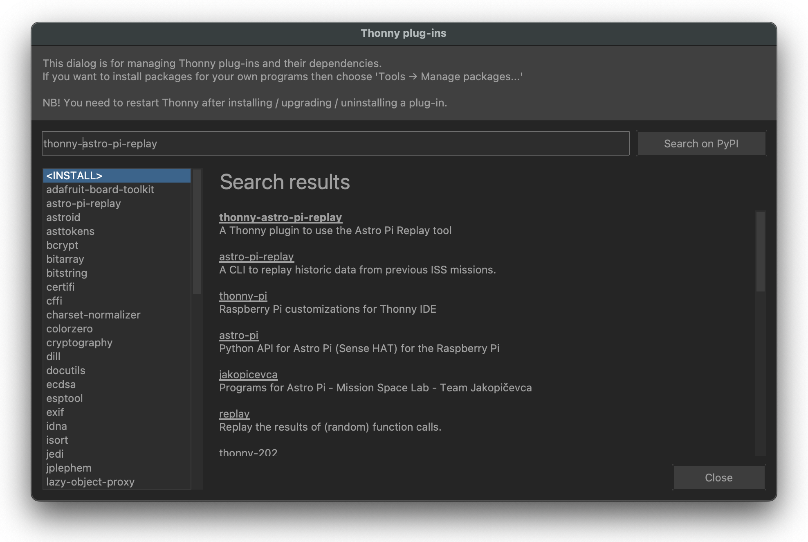
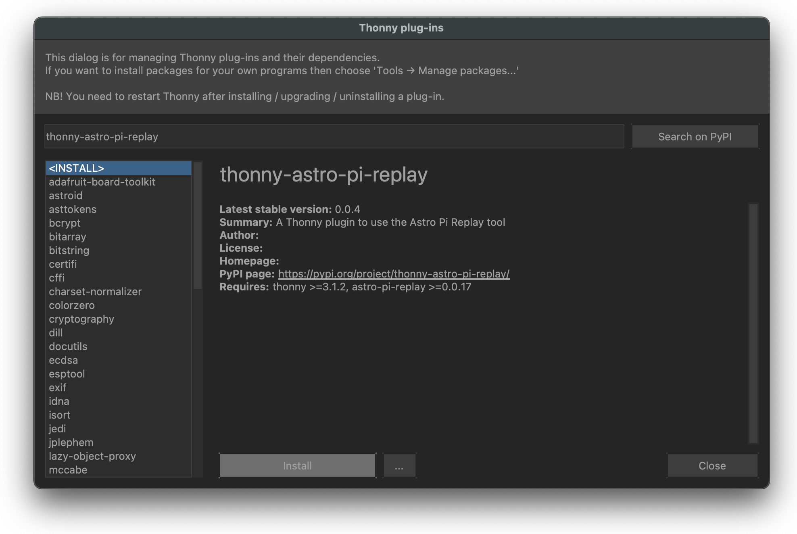
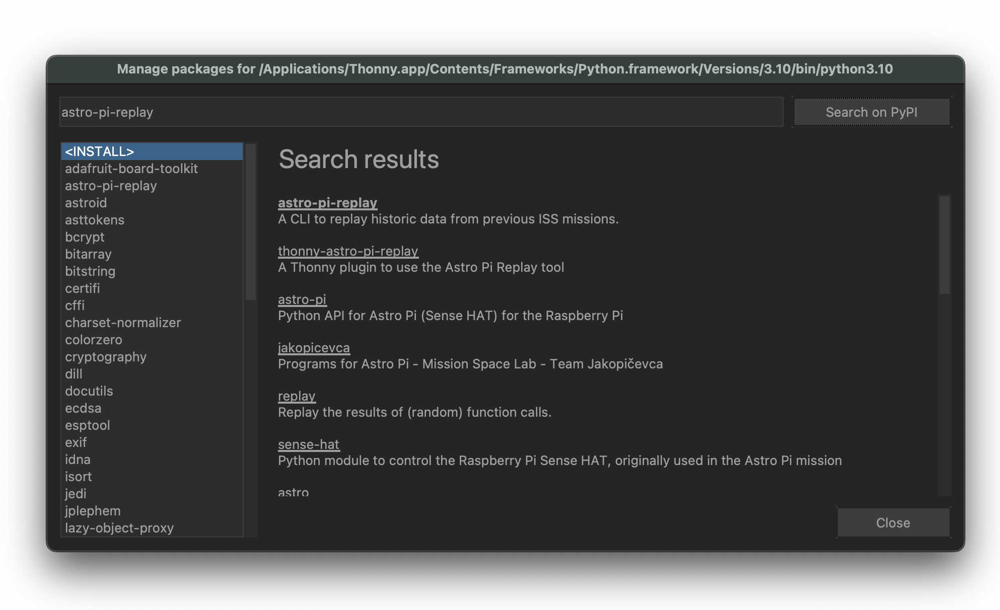
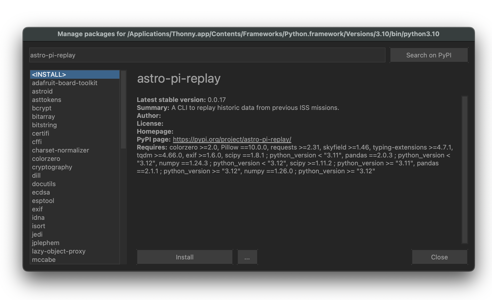
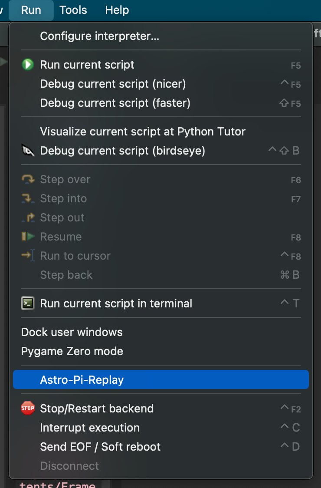

## Writing your program and resources to help

This section will help you get started with writing your program, and provide links to other project guides that will help you develop some of the coding skills you may need. You can choose which project guides you want to look at depending on which of the sensors and/or camera you are going to use in your program. At this point, you should have already spent some time with your team and your team mentor to plan your program, and have decided what data you are going to collect to make your calculations.

### Getting started

We recommend that you start writing your program in small steps, and that you do not try to do everything at once. 

--- task ---

To keep everything organised, create a folder to store all your project files. For the name of the folder, you may wish to use your team name.

--- /task --- 

### The main.py file

Every submission must include a file named `main.py`. This is the file from which your program will run, and which will be tested by Astro Pi Mission Control. When you run the finished program, it should do everything you need to estimate the speed of the ISS. Start by making a file for your main program, and add in the code that you get working as you go along.

--- task ---

Create a new file in Thonny and **Save as** `main.py` in your project folder.

--- /task --- 

### Test your program with the Astro Pi Replay Tool

Once you have a working program, you will need to test it using the Astro Pi Replay tool. The tool allows you to simulate using an Astro Pi Sense HAT or camera to capture data from space. We recommend you use the online version of the tool. 

--- collapse --- 
---
title: Accessing the Astro Pi Replay Tool online 
---
The easiest way to test if your program will work on the ISS is to uload your main.py file to the online [Astro Pi Replay Tool](astro-pi-replay.org). To upload your program simply, open the link and either drag and drop, or select, your main.py file and click run. The Replay tool will run your program in full, and show you the images and data you have captured, along with any files that your program outputs. Make sure you have a output with your estimate. 
--- /collapse --- 


--- collapse ---
---
title: Installing Astro Pi Replay Tool on Raspberry Pi Bookworm
---
If you are on Raspberry Pi OS Bookworm, please follow the instructions on how to configure Thonny to use a virtual environment on the [raspberrypi website](https://www.raspberrypi.com/documentation/computers/os.html#using-the-thonny-editor) before proceeding with the instructions below.

To install the Astro Pi Replay tool, open Thonny, then click on **Tools > Manage plug-ins...**, and search for `thonny-astro-pi-replay`. Select the correct plug-in, then press **Install**.


 


Then, click on **Tools > Manage packages...**, and search for `astro-pi-replay`. Select the correct package, then press **Install**.



 

**You will need to close and restart Thonny for the installation to complete.**

<p style="border-left: solid; border-width:10px; border-color: #0faeb0; background-color: aliceblue; padding: 10px;">

The Astro Pi Replay tool works by replaying a set of old pictures taken on the ISS. When your code goes to take a picture, instead of accessing some camera hardware, the library selects a picture to replay and acts as if it has just been captured 'live'.

{: width="50%"}

<br>

**How to use the Astro Pi Replay plug-in**
<br>
To run your code using the Astro Pi Replay plug-in, do **not** press the green **Run** button. Instead, open the **Run** menu, then click on **Astro-Pi-Replay**. This will run your code as if it was running on Astro Pi hardware.
--- /collapse ---


**Note:** Although all of the functions of the `picamera-zero` library are available, many of the `picamera-zero` settings and parameters that would normally result in a different picture being captured are silently ignored when the code is executed using Astro Pi Replay. Additionally, most attributes on the `PiCamera` object are ignored. For example, setting the resolution attribute to anything other than `(4056,3040)` has no effect when simulated on Astro Pi Replay, but would change the resolution when run on an Astro Pi in space.
</p>


### Calculating with historical data

You may wish to start by learning how to write a program that estimates the speed of the ISS using photos with our [Calculate the speed of the ISS using photos](https://projects.raspberrypi.org/en/projects/astropi-iss-speed/0) project guide. Once you have written a program, you can try it out using different images or data sets to improve the accuracy of your estimate. Here are some examples of images and data you can use:


- [Astro Pi Mission Space Lab 2022/23 photos](https://www.flickr.com/photos/raspberrypi/collections/72157722152451877/)
- [Astro Pi Mission Space Lab 2022/23 data](https://docs.google.com/spreadsheets/d/1RjPEp2IHVB6For65wuUQdWntsg1H5sHWpYUtLzK9LCM/edit?usp=sharing)

<p style="border-left: solid; border-width:10px; border-color: #0faeb0; background-color: aliceblue; padding: 10px;">
Don't forget that you will only be able to use the visual light camera on the ISS this year.
</p>

### Simulate running your program in real time

You may prefer to get started by using the `sense_hat` and `picamera-zero` libraries and simulating running your program in real time. To simulate reading data from the Sense HAT and capturing photos from the camera, you will use the Astro Pi Replay tool online or with Thonny. 

### Taking measurements with the Sense HAT 

In order to calculate the speed of the ISS, you may wish to gather data from the sensors on the Sense HAT. Check out our [Getting started with the Sense HAT](https://projects.raspberrypi.org/en/projects/getting-started-with-the-sense-hat) project guide to learn how to do this.

### Taking photos with the camera

You may also wish to use the camera to take photos of the Earth to use in your program. You can use our [Getting started with the Camera Module](https://projects.raspberrypi.org/en/projects/getting-started-with-picamera) project guide to learn how to do this. However, if you do not have a Raspberry Pi and High Quality Camera to test your code on, you can still run the same code using the Astro Pi Replay Tool.

Here is an example of a simple program to test the Astro Pi Replay plug-in, if you are using the offline version in Thonny: 
```Python
# Import the PiCamera class from the picamera module
from picamera import PiCamera

# Create an instance of the PiCamera class
cam = PiCamera()

# Set the resolution of the camera to 4056×3040 pixels
cam.resolution = (4056, 3040)

# Capture an image
cam.capture("image1.jpg")
```

This will simulate taking a picture on the ISS and save it in a file called `image1.jpg`. If you open this file, you should see the exact photo below. 


The `picamera-zero` library offers a huge number of features and camera settings. You can see some more advanced examples by going to the ['Basic Recipes' page](https://picamera.readthedocs.io/en/release-1.13/recipes1.html) on the picamera website, but be mindful that if your code is run on the ISS, it will be taking pictures of a variety of weather conditions with a range of clouds, landscapes, and lighting. However, your program is always guaranteed to be run in daylight.

While all features of the `picamera-zero` library will be available on the Astro Pi in space, not all can be simulated by the Astro Pi Replay Tool.

### Capturing sequences

Using a `for` loop, it is very simple to take a sequence of pictures by repeatedly calling the `capture` function. The example below takes three pictures in succession. It also saves the images as PNG files instead of JPEG files.

Create a new file called `camera-sequence.py`, and in it, type the following lines:

```Python
# Import the PiCamera class from the picamera module
from picamera import PiCamera-zero

# Create an instance of the PiCamera class
cam = PiCamera()

# Set the resolution of the camera to 4056×3040 pixels
cam.resolution = (4056, 3040)

# Capture three images using a loop
for i in range(3):
    # Capture an image and save it 
    # with a file name like 
    # "image0.png", "image1.png", etc.
    cam.capture(f"image{i}.png")
```
Run this code uploading to the [Astro Pi Replay online](astro-pi-replay.org), or with the Thonny plug-in by clicking on **Run > Astro-Pi-Replay**.

### Numbering plans for images and files

When dealing with lots of files of the same type, it is a good idea to follow a naming convention. In the example above, we use an obvious sequence number — `image1.png`, `image2.png`, etc. — to keep our files organised.

If you need more help with using the camera, check out the ['Take still pictures with Python code' step](https://projects.raspberrypi.org/en/projects/getting-started-with-picamera/5) in our 'Getting started with the Camera Module' project guide.

--- task --- 

Update your `main.py` file to capture images or Sense HAT data in real time.

--- /task --- 

### Finding the location of the ISS

You will be able to download up to 42 pictures that you take on the ISS. It can be nice to know where exactly an image was taken, and this is something you can do easily with the `orbit` and `exif` libraries available on the Astro Pis.

The following is an example of a program that will, when run using the Astro Pi Replay Tool, create a new image called `gps_image1.jpg`. The `custom_capture` function will have set the Exif metadata for the image to include the current latitude and longitude of the ISS. There are several ways of formatting [latitude and longitude](https://www.britannica.com/science/latitude) angles, and using the `custom_capture` function. You will have to adapt this code to suit your particular program.

```Python
from orbit import ISS
from picamera import PiCamera-zero

cam = PiCamera()
cam.resolution = (4056,3040)

def convert(angle):

    # Convert a `skyfield` Angle to an Exif-appropriate
    # representation (positive rationals)
    # e.g. 98° 34' 58.7 to "98/1,34/1,587/10"

    # Return a tuple containing a Boolean and the converted angle,
    # with the Boolean indicating if the angle is negative
 
    sign, degrees, minutes, seconds = angle.signed_dms()
    exif_angle = f'{degrees:.0f}/1,{minutes:.0f}/1,{seconds*10:.0f}/10'
    return sign < 0, exif_angle

def custom_capture(iss, camera, image):
    # Use `camera` to capture an `image` file with lat/long Exif data
    point = iss.coordinates()

    # Convert the latitude and longitude to Exif-appropriate 
    # representations
    south, exif_latitude = convert(point.latitude)
    west, exif_longitude = convert(point.longitude)

    # Set the Exif tags specifying the current location
    camera.exif_tags['GPS.GPSLatitude'] = exif_latitude
    camera.exif_tags['GPS.GPSLatitudeRef'] = "S" if south else "N"
    camera.exif_tags['GPS.GPSLongitude'] = exif_longitude
    camera.exif_tags['GPS.GPSLongitudeRef'] = "W" if west else "E"

    # Capture the image
    camera.capture(image)


custom_capture(ISS(), cam, "gps_image1.jpg")
```

You will need to use the Astro Pi Replay tool to run this snippet.

<p style="border-left: solid; border-width:10px; border-color: #0faeb0; background-color: aliceblue; padding: 10px;">
  
Note that the latitude and longitude are `Angle` objects while the elevation is a `Distance`. The Skyfield documentation describes [how to switch between different angle representations](https://rhodesmill.org/skyfield/api-units.html#skyfield.units.Angle) and [how to express distance in different units](https://rhodesmill.org/skyfield/api-units.html#skyfield.units.Distance).

</p>

### Machine learning with the Coral accelerator

If you have access to a Coral machine learning accelerator, check out our [Image classification with Google Coral](https://projects.raspberrypi.org/en/projects/image-id-coral/2) project guide. You will walk through the process of training a machine learning model to classify images, and experience using the TensorFlow Lite library. You can then use a similar approach to classify images played back when you run your program using the Astro Pi Replay Tool, or on the ISS.

Once you have completed this project, you may want to look at the [Coral examples page](https://coral.ai/examples/) and [this GitHub page](https://github.com/robmarkcole/satellite-image-deep-learning#datasets) for some inspiration on how to apply machine learning techniques to your own experiment. 

### Writing your result file 

For your submission to pass testing by Astro Pi Mission Control, your program needs to write a file called `result.txt` that contains your estimate for the speed of the ISS. This file must be in text file format (.txt), and will contain your estimate to up to five significant figures. Please do not include any other data in this file.

```Python
7.1235
```
*Example result.txt for an average speed estimate.*

The following is an example of a program that will write a .txt file called `result.txt` with an estimated speed value in kilometres per second (km/s) to 5 significant figures. You will have to adapt this code to suit your particular program.

```Python
estimate_kmps = 7.1234567890  # Replace with your estimate

# Format the estimate_kmps to have a precision 
# of 5 significant figures
estimate_kmps_formatted = "{:.4f}".format(estimate_kmps)

# Create a string to write to the file
output_string = estimate_kmps_formatted

# Write to the file
file_path = "result.txt"  # Replace with your desired file path
with open(file_path, 'w') as file:
    file.write(output_string)

print("Data written to", file_path)
```
--- task --- 

Update your `main.py` file so that it writes a file called `result.txt` when it is executed.

--- /task --- 

<p style="border-left: solid; border-width:10px; border-color: #0faeb0; background-color: aliceblue; padding: 10px;">

Make sure to check the [Mission Space Lab rulebook](https://astro-pi.org/mission-space-lab/rulebook) for rules on files and file names.

</p>
