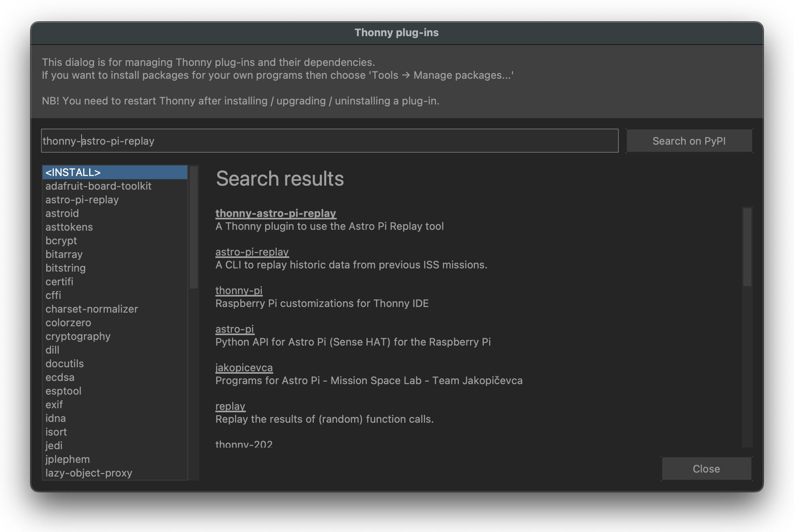
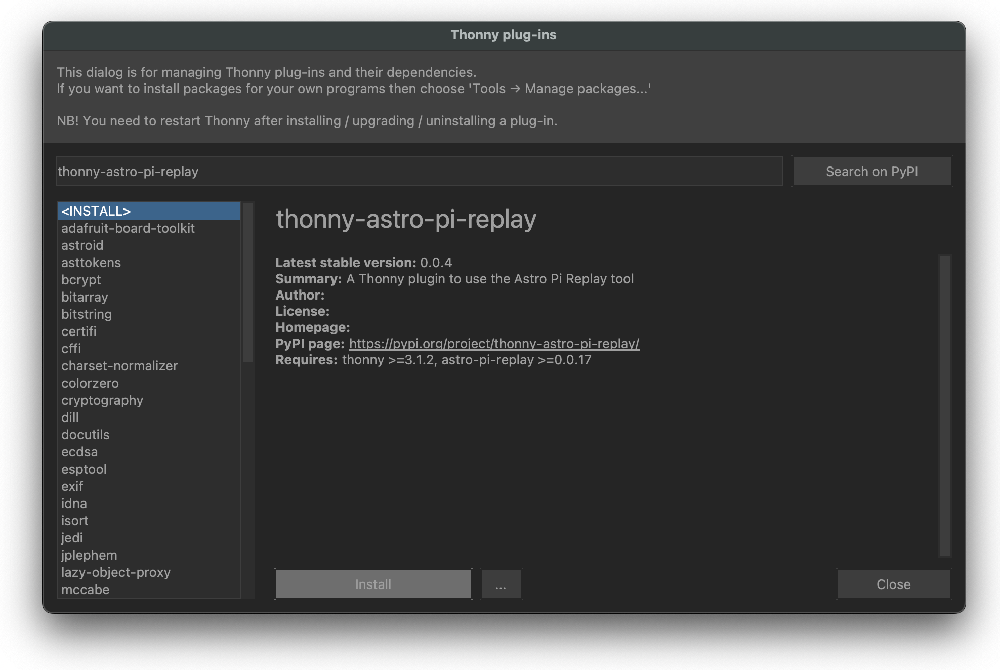
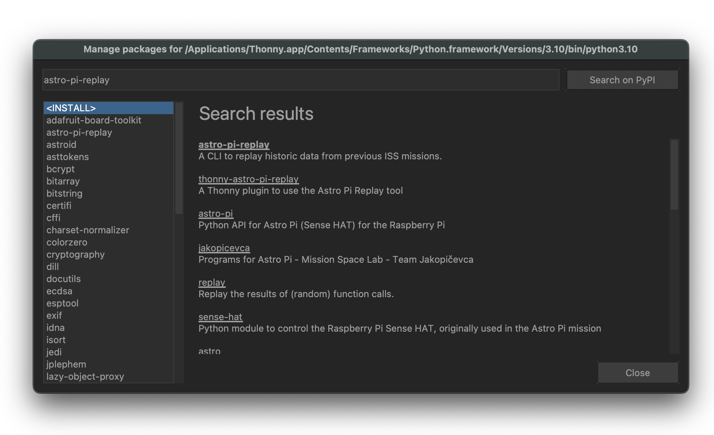
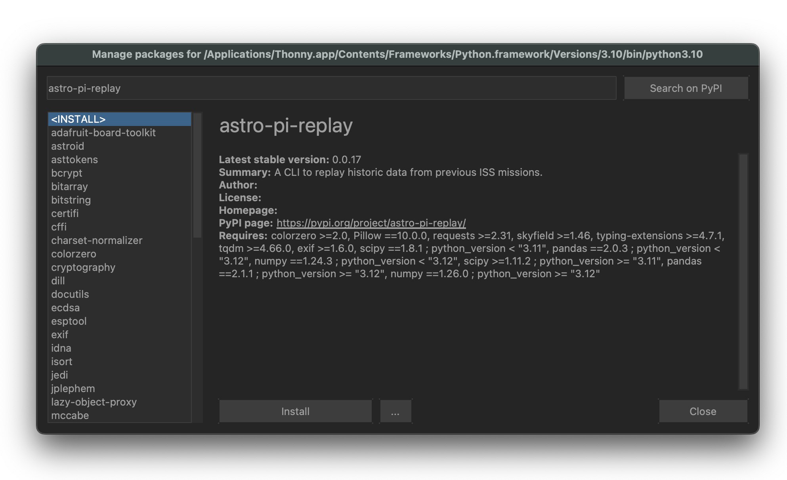
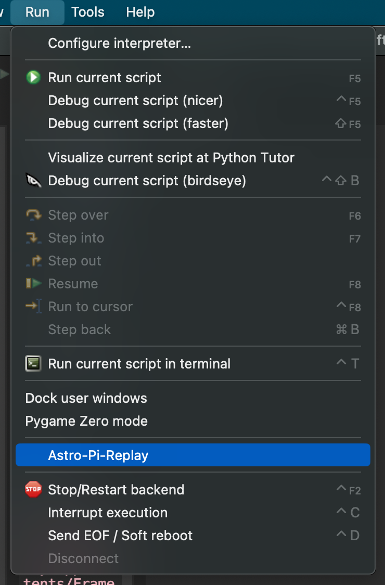

## Pro tips to improve your program

This section will provide you with help with writing and testing your program, and provide links to other project guides that will help you develop some of the coding skills you may need. You can choose which project guides you want to look at depending on which of the sensors and/or camera you are going to use in your program. At this point, you should have already spent some time with your team and your team mentor to plan your program, and have decided what data you are going to collect and save. 


### Capturing sequences

Using `picamzero` it is very simple to take a sequence of pictures by calling the `capture_sequence` function. The example below takes three pictures in succession, with a 3 second gap between each one.

Create a new file called `camera-sequence.py`, and in it, type the following lines:

```Python
# Import the Camera class from the picamzero (picamzero) module
from picamzero import Camera

# Create an instance of the Camera class
cam = Camera()

cam.capture_sequence("sequence", num_images=3, interval=3)
```
Run this code using [Astro Pi Replay online](https://rpf.io/replay)), or with the Thonny plug-in by clicking on **Run > Astro-Pi-Replay**.

### Numbering plans for images and files

When dealing with lots of files of the same type, it is a good idea to follow a naming convention. In the example above, we use an obvious sequence number — `image1.png`, `image2.png`, etc. — to keep our files organised.

If you need more help with using the camera, check out the ['Take still pictures with Python code' step](https://projects.raspberrypi.org/en/projects/getting-started-with-picamera/5) in our 'Getting started with the Camera Module' project guide.

--- task --- 

Update your `main.py` file to capture images or Sense HAT data in real time.

--- /task --- 


### Using NDVI (Normalized Difference Vegetation Index

Learn how to process visual light data to analyze plant health, vegetation density, and environmental features across the Earth's surface using this project guide:  [NDVI (Normalized Difference Vegetation Index)](https://projects.raspberrypi.org/en/projects/astropi-ndvi/0) 

### Finding the location of the ISS

You will be able to download up to 42 pictures that you take on the ISS. It can be nice to know where exactly an image was taken, and this is something you can do easily with the `astro_pi_orbit` and `exif` libraries available on the Astro Pis.

The following is an example of a program that will, when run using the Astro Pi Replay Tool, create a new image called `gps_image1.jpg`. The `picamzero` library will have set the Exif metadata for the image to include the current latitude and longitude of the ISS.

```Python
from astro_pi_orbit import ISS
from picamzero import Camera

iss = ISS()

def get_gps_coordinates(iss):
    """
    Returns a tuple of latitude and longitude coordinates expressed
    in signed degrees minutes seconds.
    """
    point = iss.coordinates()
    return (point.latitude.signed_dms(), point.longitude.signed_dms())

cam = Camera()
cam.take_photo("gps_image1.jpg", gps_coordinates=get_gps_coordinates(iss))
```

You will need to use the Astro Pi Replay tool to run this snippet.

<p style="border-left: solid; border-width:10px; border-color: #0faeb0; background-color: aliceblue; padding: 10px;">
  
Note that the latitude and longitude are `Angle` objects while the elevation is a `Distance`. The Skyfield documentation describes [how to switch between different angle representations](https://rhodesmill.org/skyfield/api-units.html#skyfield.units.Angle) and [how to express distance in different units](https://rhodesmill.org/skyfield/api-units.html#skyfield.units.Distance).

</p>

### Calculating the speed of the ISS 

You may wish to start by learning how to write a program using historical photos taken by teams in previous years with our [Calculate the speed of the ISS using photos](https://projects.raspberrypi.org/en/projects/astropi-iss-speed/0) project guide. Once you have written a program, you can try it out using different images or data sets to improve the accuracy of your estimate. Here are some examples of images and data you can use:

- [Astro Pi Mission Space Lab 2022/23 photos](https://www.flickr.com/photos/raspberrypi/collections/72157722152451877/)
- [Astro Pi Mission Space Lab 2022/23 data](https://docs.google.com/spreadsheets/d/1RjPEp2IHVB6For65wuUQdWntsg1H5sHWpYUtLzK9LCM/edit?usp=sharing)

### Simulate running your program in real time

You may prefer to get started by using the `sense_hat` and `picamzero` libraries and simulating running your program in real time. To simulate reading data from the Sense HAT and capturing photos from the camera, you will use the Astro Pi Replay tool online or with Thonny.

### Closing resources 

When your program, it is a good idea to close all resources that you have open. For example, close all files that you have open: 

```Python
file = open(file)
file.close()
```
--- task --- 

Review your `main.py` file and update it so that it closes all resources appropriately.

--- /task --- 

#### Test your program with the Astro Pi Replay Tool

The Astro Pi Replay Tool acts as a kind of simulator you can use on Earth that will make your program act as if it is running on an Astro Pi on board the ISS. It allows you to test your code before it goes to space without needing to have a Raspberry Pi, camera, or Sense HAT. The simulation is not perfect, however, and will only produce photos and sensor data from within its own data set, but it should still allow you to test that your program would work when running on board the ISS.

There is an online version and an offline version, available as a Thonny plug-in, for you to test your program. We recommend you use the online version of the tool. 

--- collapse --- 
---
title: Accessing the Astro Pi Replay Tool online 
---
The easiest way to test if your program will work on the ISS is to upload your main.py file to the online [Astro Pi Replay Tool](https://rpf.io/replay). 

To upload your program simply, open the link and either drag and drop, or select, your main.py file and click run. The Replay tool will run your program in full, and show you the images and data you have captured, along with any files that your program outputs. 

--- /collapse --- 


--- collapse ---
---
title: Installing Astro Pi Replay Tool on Raspberry Pi Bookworm
---
If you are on Raspberry Pi OS Bookworm, please follow the instructions on how to configure Thonny to use a virtual environment on the [raspberrypi website](https://www.raspberrypi.com/documentation/computers/os.html#using-the-thonny-editor) before proceeding with the instructions below.

To install the Astro Pi Replay tool, open Thonny, then click on **Tools > Manage plug-ins...**, and search for `thonny-astro-pi-replay`. Select the correct plug-in, then press **Install**.


 


Then, click on **Tools > Manage packages...**, and search for `astro-pi-replay`. Select the correct package, then press **Install**.



 

If you have taken part in Mission Space Lab before and have already downloaded the Astro Pi Replay tool, you should re-install the `astro-pi-replay` library to make sure you have the latest version. To do this, remove the `~/.astro_pi_replay` directory in your home folder (e.g. using the command `rm -rf ~/.astro_pi_replay` in a Terminal window) and then follow the instructions above, as if you had not installed `astro-pi-replay` before.

**You will need to close and restart Thonny for the installation to complete.**

<p style="border-left: solid; border-width:10px; border-color: #0faeb0; background-color: aliceblue; padding: 10px;">

The Astro Pi Replay tool works by replaying a set of old pictures taken on the ISS. When your code goes to take a picture, instead of accessing some camera hardware, the library selects a picture to replay and acts as if it has just been captured 'live'.

{: width="50%"}

<br>

**How to use the Astro Pi Replay plug-in**
<br>
To run your code using the Astro Pi Replay plug-in, do **not** press the green **Run** button. Instead, open the **Run** menu, then click on **Astro-Pi-Replay**. This will run your code as if it was running on Astro Pi hardware.
--- /collapse ---


**Note:** Although all of the functions of the `picamzero` library are available, many of the `picamzero` settings and parameters that would normally result in a different picture being captured are silently ignored when the code is executed using Astro Pi Replay. Additionally, most attributes on the `Camera` object are ignored. For example, setting the resolution attribute to anything other than `(4056,3040)` has no effect when simulated on Astro Pi Replay, but would change the resolution when run on an Astro Pi in space.
</p>


### Preparing for the unexpected

A program can fail for many reasons, but with some foresight and planning, it is possible for your program to deal with these issues instead of crashing and losing the chance to capture data and images aboard the ISS. In this section, you are going to try to find ways to improve your program so that it stands the best chance of working as intended if something unexpected happens.


--- collapse ---
---
title: "Exception handling"
---

An exception is when something happens while a program is running that it does not know how to handle. This can cause the program to crash, unless it has a procedure to follow in the event of something going wrong.

Visit Ada Computer Science to learn more about [exception handling](https://adacomputerscience.org/concepts/design_exception?examBoard=all&stage=gcse). 

--- /collapse ---

--- collapse ---
---
title: "File buffering"
---

When you write to a file using the `open` function, Python normally does not save the file to disk immediately. Instead, it keeps the file contents to save in a temporary storage area in the computer's memory called a buffer. Python does this so that it can choose the best time to write to the disk — something that normally does not matter us. But while the data is in the buffer and not yet saved to the disk, there is a chance that it could be lost if an error occurs. To prevent this from happening, we can tell Python to save the buffer to disk at the end of every line of text by setting the `buffering` argument to `1`:

```Python
with open("some_file.txt", "w", buffering=1) as f:
    f.write("example data")
```

--- /collapse ---

<p style="border-left: solid; border-width:10px; border-color: #0faeb0; background-color: aliceblue; padding: 10px;">
  
**Note:** If you are writing bytes to a file (with argument `"wb"`), then you should tell Python to not use a buffer at all and to write the data to disk immediately. You can do this by setting the `buffering` argument to `0`.
</p>

--- task --- 

Review your program and consider if you need to set the buffering mode when writing to a file.

--- /task --- 

--- collapse ---
---
title: "Logging"
---

If your program fails, then it is always helpful to have a record of what happened, so that you can fix it for next time. The `logzero` Python library ([documentation here](https://logzero.readthedocs.io/en/latest/)) makes it easy to make notes about what's going on in your program. You can log lots of information about what happens in your program — every loop iteration, every time an important function is called — and if you have conditionals in your program, `logzero` will log which route the program went (`if` or `else`). But remember that you cannot download more than 250MB of data from the ISS.

Here is a basic example of how `logzero` can be used to keep track of loop iterations:

```Python
from logzero import logger, logfile
from time import sleep

logfile("events.log")

for i in range(10):
    logger.info(f"Loop number {i+1} started")
    ...
    sleep(60)
```

The two main types of log entry you can use are `logger.info()` to log information, and `logger.error()` when your program experiences an unexpected error or handles an exception. There is also `logger.warning()` and `logger.debug()`.

--- /collapse ---

<p style="border-left: solid; border-width:10px; border-color: #0faeb0; background-color: aliceblue; padding: 10px;">
  
We recommend that you always use the `logzero` library (for logging important events that take place during your experiment), even if you also write sensor data to a file.
</p>

Once you have finished writing your program and you believe it provides the ISS speed estimate in the correct format and follows best practices like logging and handling errors, it is crucial to thoroughly test your program using the Astro Pi Replay Tool.

### Averages 

If your program calculates multiple readings from your sensor data (for example, by calculating the speed from sequences of two photos), then you may need to decide how to reduce these estimates into an averaged number. If you used a simple average ([mean](https://en.wikipedia.org/wiki/Mean)), could you explore the accuracy of other statistical measures, such as the median and other percentiles?

There is a lot of scope for being creative when improving the accuracy of your data. One method is to be selective about which photos or data you use in your calculations. If you can determine that a specific sequence of data is the most reliable, then you could weight this data more highly in your final calculations. 

<p style="border-left: solid; border-width:10px; border-color: #0faeb0; background-color: aliceblue; padding: 10px;">
  
Be cautious about training your program to be oversensitive to the exact sequence shown when using Astro Pi Replay — the sequence on the ISS will be different, and you want your program to be accurate on the ISS most of all!
