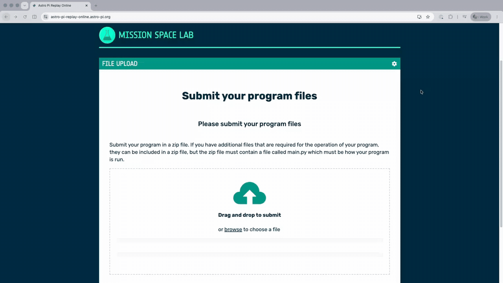

# Testing your program

## Program checklist

Whether you have just started writing your program or have nearly finished it, regular testing is essential. Testing as you go helps you identify problems early and gives you confidence that your code will run successfully on the ISS.

Double-check that your program has the following basic functionality:

Your program should:
 * Contain a file called `main.py` containing your main logic
 * Read from a Sense HAT sensor or take a photo using the Astro Pi camera
 * Save a photo or sensor data to a file
 * Stop before 10 minutes have elapsed

--- task ---

Check your program adheres to the [Mission Space Lab Rulebook](https://astro-pi.org/mission-space-lab/rulebook).

--- /task ---


## Astro Pi Replay Tool

Testing a program designed to run on the ISS might seem difficult when you don't have access to an Astro Pi. That's why we've created the [Astro Pi Replay Tool](https://rpf.io/replay). With this tool, you can test your program without needing any special hardware.

<p style="border-left: solid; border-width:10px; border-color: #0faeb0; background-color: aliceblue; padding: 10px;">

The Astro Pi Replay Tool simulates the Astro Pi environment using data collected during previous Astro Pi missions. For example, when your program takes a photo, the Replay Tool provides one of a set of historical images captured on the ISS instead of accessing a real camera. To your code, it appears as though the image has just been taken, allowing you to develop and test your programs without needing access to Astro Pi hardware.

</p>

The Replay Tool is available in two versions:

* An **online version**, which runs on your web browser
* An **offline version**, available as a Thonny plug-in

We recommend using the online version, as it requires no installation and is the quickest way to start testing your program.


--- collapse ---
---
title: Accessing the Astro Pi Replay Tool online
---
The easiest way to test if your program will work on the ISS is to upload your `main.py` file to the online [Astro Pi Replay Tool](https://rpf.io/replay).

To run your program, open the link and either drag and drop or select your `main.py` file and click **Run**. The Replay Tool will run your program in full and show you the images and data you have captured along with any files that your program outputs.

--- /collapse ---

--- collapse ---
---
title: Installing Astro Pi Replay Tool Thonny plug-in
---
If you are on Raspberry Pi OS, you will need to follow the instructions on how to configure Thonny to use a virtual environment on the [Raspberry Pi website](https://www.raspberrypi.com/documentation/computers/os.html#using-the-thonny-editor) before proceeding with the instructions below.

If you have taken part in Mission Space Lab before and have previously installed the Astro Pi Replay Tool, you should re-install the `astro-pi-replay` library to make sure you have the latest version. To do this, remove the `~/.astro_pi_replay` directory in your home folder (e.g. using the command `rm -rf ~/.astro_pi_replay` in a Terminal window) and then follow the instructions below.

To install the Astro Pi Replay Tool, open Thonny, click on **Tools > Manage plug-ins...**, and search for `thonny-astro-pi-replay`. Select the correct plug-in, then press **Install**.


Next, click on **Tools > Manage packages...**, and search for `astro-pi-replay`. Select the correct package, then press **Install**.


**You will need to close and restart Thonny for the installation to complete.**


--- /collapse ---

<p style="border-left: solid; border-width:10px; border-color: #0faeb0; background-color: aliceblue; padding: 10px;">


**Note:** Although all of the functions of the `picamzero` library are available, many of the `picamzero` settings and parameters that would normally result in a different picture being captured are silently ignored when the code is executed using Astro Pi Replay. Additionally, most attributes on the `Camera` object are ignored. For example, setting the resolution attribute to anything other than `(4056,3040)` has no effect when simulated on Astro Pi Replay, but would change the resolution when run on an Astro Pi in space.
</p>

### Testing your program

To test your program and simulate it running aboard the ISS, go to the [Astro Pi Replay Tool](https://rpf.io/replay) and submit your program file. If you are using the Astro Pi Replay plug-in with Thonny, run your `main.py` code through the Astro Pi Replay plug-in by opening the **Run** menu and clicking on **Astro-Pi-Replay**.

Your code should complete within 10 minutes.



If you are using the online version of the Astro Pi Replay Tool, you may download a zip file of the output of your program.

Once your program has finished, review the output and check the following:

* Did your program create the data file(s) you expected in your project folder? 
* Were any additional output files created?
* Do your saved files comply with the [Rulebook](https://astro-pi.org/mission-space-lab/rulebook), including the 250MB storate limit and permitted file types?
* Do your log files contain any warnings or errors? 

If you find any errors, warnings, or unexpected behaviour, make changes to your code and test it again. The Astro Pi Replay Tool can be used as many times as you like, so keep refining your program until you are confident that it works reliably and is ready for submission.

Thorough testing will give your team the best chance of achieving **flight status** and having your program run on the ISS.

--- task ---

Test your program with the Astro Pi Replay Tool and check the output for any problems or unexpected behaviour.

--- /task ---

# Troubleshooting

If your program encounters some errors and doesn't work the first time you test it, there are some useful programming tips that can help you to identify and fix them. 

## Dealing with errors and exceptions

When Python encounters a problem, it may raise an error or an exception. If your program does not handle this situation, it may stop running unexpectedly.

By anticipating potential problems and using exception handling, you can make your program more reliable. Instead of crashing, your code can respond to the issue and continue running, reducing the risk of missing out on valuable data or images during its time on the ISS.

Visit Ada Computer Science to learn more about [exception handling](https://adacomputerscience.org/concepts/design_exception?examBoard=all&stage=gcse).

--- task ---

Review your program and consider if you need to set the buffering mode when writing to a file.

--- /task ---

## Logging

If your program encounters a problem, it can be useful to have a record of what happened. Logging allows you to keep track of your program's behaviour and can help you identify and fix issues when analysing your results after the mission.

The `logzero` library ([documentation here](https://logzero.readthedocs.io/en/latest/)) provides a simple way to record information about what your program is doing. For example, you might log:

* Each iteration of a loop
* When an important function is called
* Sensor readings or key calculations
* Which branch of an if/else statement was executed

Be careful not to log more information than you need. All logged data counts towards your download allowance, and **teams can download a maximum of 250MB of data** from the ISS.

The example below uses `logzero` to record each iteration of a loop:

```Python
from logzero import logger, logfile
from time import sleep

logfile("events.log")

for i in range(10):
    logger.info(f"Loop number {i+1} started")
    ...
    sleep(60)
```

The two main types of log entry you can use are `logger.info()` to log information, and `logger.error()` when your program experiences an unexpected error or handles an exception. There is also `logger.warning()` and `logger.debug()`.


<p style="border-left: solid; border-width:10px; border-color: #0faeb0; background-color: aliceblue; padding: 10px;">

We recommend using the `logzero` library in all Mission Space Lab projects. Logging important events can help you understand what happened during your experiment and diagnose problems, even if you are already recording sensor data elsewhere.

</p>

## Closing resources

When your program finishes, it is good practice to close any resources that are still open. This includes files, cameras, and other objects that use system resources.

Closing resources helps ensure that all data is saved correctly and that your program exits cleanly.

For example, if you have opened a file, you should close it when you have finished writing to it:


```Python
file = open(file)
file.close()
```
--- task ---

Review your `main.py` file and update it so that it closes all resources appropriately.

--- /task ---


## Common mistakes

Some Mission Space Lab teams have encountered issues that prevented their programs from achieving flight status or running successfully on the ISS.

The list below highlights some of the most common mistakes and explains why they can cause problems in the flight environment. Not every item will apply to your project, but reviewing the list carefully may help you identify issues before you submit your code.


--- collapse ---
---
title: "Logging `skyfield` or `astro_pi_orbit` ISS coordinates instead of using a sensor"
---

Your code must use record some data from a sensor or capture a photo to a file to get Flight Status. Using `skyfield` or `astro_pi_orbit` to log the current ISS coordinates does not count because this method looks up the ISS position in a table of predicted positions, and does not actually use a sensor or camera.

--- /collapse ---

--- collapse ---
---
title: "Opening and closing the camera repeatedly"
---

If you create multiple `Camera` objects, for example in a loop, you are likely to make the Raspberry Pi run out of memory and not have your program accepted by Astro Pi Mission Control.

--- /collapse ---

--- collapse ---
---
title: "Storing more than 42 images"
---

Your program is not allowed to retain more than 42 images at the end of the 10 minutes — though it can store more than that while it is running.

--- /collapse ---

--- collapse ---
---
title: "User input"
---

Your program cannot rely on interaction with an astronaut to work.

--- /collapse ---

--- collapse ---
---
title: "Using the LED matrix"
---

Your program is not allowed to use the LED matrix.

--- /collapse ---

--- collapse ---
---
title: "Use of absolute file paths"
---

Make sure that you do not use any specific paths for your data files. Use the `__file__` variable.

--- /collapse ---

--- collapse ---
---
title: "Not saving data immediately"
---

Make sure that any experimental data is written to a file as soon as it is recorded. Avoid saving data to an internal list or dictionary as you go along and then writing it all to a file at the end of the experiment, because if your experiment ends abruptly due to an error or exceeding the 10-minute time limit, you will not get any data.

--- /collapse ---

--- collapse ---
---
title: "Running out of space"
---

You are allowed to produce up to 250MB of data. Remember that the size of an image file will depend not only on the resolution, but also on how much detail is in the picture — a photo of a blank white wall will be smaller than a photo of a landscape. Using Astro Pi Replay will give you a good idea of how many pictures you will be able to take.

--- /collapse ---

--- collapse ---
---
title: "Forgetting to call your function"
---

We have seen cases where teams have written a function but forgotten to call it in their `main.py` program — watch out!

--- /collapse ---

--- collapse ---
---
title: "Saving into directories that do not exist"
---

A number of teams want to organise their data into directories such as data, images, etc. This in and of itself is a really good thing, but it is easy to forget to make these directories before writing to them.

--- /collapse ---

--- collapse ---
---
title: "Networking"
---

For security reasons, your program is not allowed to access the network on the ISS. It should not attempt to open a socket, access the internet, or make a network connection of any kind. This includes local network connections back to the Astro Pi itself.

--- /collapse ---

--- collapse ---
---
title: "Trying to run another program"
---

In addition to not being able to use any networking, your program is not allowed to run another program or any command that you would normally type into the terminal window of the Raspberry Pi, such as `vcgencmd`.

--- /collapse ---

--- collapse ---
---
title: "Multiple threads"
---

If you need to do more than one thing at a time, you can use a multithreaded process. There are a number of Python libraries that allow this type of multitasking to be included in your code. However, to do this on the Astro Pis, you are only permitted to use the `threading` library.

Only use the `threading` library if absolutely necessary. Managing threads can be tricky, and as your program will be run as part of a sequence of many other programs, we need to make sure that the previous one has ended smoothly before starting the next. Rogue threads can behave in an unexpected manner and take up too much of the system resources. If you do use threads in your code, you should make sure that they are all managed carefully and closed cleanly at the end of your program. You should also make sure that comments in your code clearly explain how this is achieved.

--- /collapse ---

--- collapse ---
---
title: "Setting the program execution time too short"
---

Some teams set their program execution time to a small value (e.g. 1 minute) for testing and then forget to change it back to an appropriate value. Make sure to use as much of your allocated time slot as possible.

--- /collapse ---

--- collapse ---
---
title: "ZeroDivisionError"
---

If your program tries to calculate the speed of the ISS, you will need to make sure that it doesn't try to divide by zero when it tries to calculate the speed. This can happen when the image time fields are rounded to the nearest second (such as when using the `datetime_digitized` field, as in the [Calculate the speed of the ISS using photos](https://projects.raspberrypi.org/en/projects/astropi-iss-speed) project). If your code takes two photos in less than one second, they might appear to have the same timestamp, which will cause a `ZeroDivisionError` and make your program crash.

To stop this, you can add a `sleep` command to your code. This will ensure that there is at least a 1-second gap between each photo:

```python
from time import sleep
from picamzero import Camera

camera = Camera()
camera.take_photo("image1.jpg")
sleep(1)
camera.take_photo("image2.jpg")
```

--- /collapse ---

--- collapse ---
---
title: "Not using full-resolution images when calculating ISS speed"
---

If you are using code from the [Calculate the speed of the ISS using photos](https://projects.raspberrypi.org/en/projects/astropi-iss-speed) project, beware that the ground sampling distance (GSD) changes with image resolution.

The value used in the [Calculate the speed of the ISS using photos](https://projects.raspberrypi.org/en/projects/astropi-iss-speed/0) project guide is only valid for images in full resolution, `(4056x3040)`, but not necessarily for smaller resolutions. For this reason, we recommend that you capture full-resolution images.

--- /collapse ---

--- collapse ---
---
title: "cv2.error when calculating image features"
---

If you are following the [Calculate the speed of the ISS using photos](https://projects.raspberrypi.org/en/projects/astropi-iss-speed) project and the photos you are comparing lack enough contrast, the `calculate_features` function might return `None` instead of the image descriptor data. This is a common cause of bugs, as later functions like `calculate_matches` expect a `numpy` array and will crash if they receive `None` instead.

To stop your program from crashing when this happens, you can wrap your code in a `try-except` statement like this:

```python
cv_error_count = 0
max_cv_errors = 5

for i in range(10):
    try:
        time_difference = get_time_difference(image_1, image_2) # Get time difference between images
        image_1_cv, image_2_cv = convert_to_cv(image_1, image_2) # Create OpenCV image objects
        keypoints_1, keypoints_2, descriptors_1, descriptors_2 = calculate_features(image_1_cv, image_2_cv, 1000) # Get keypoints and descriptors
        matches = calculate_matches(descriptors_1, descriptors_2) # Match descriptors
        display_matches(image_1_cv, keypoints_1, image_2_cv, keypoints_2, matches) # Display matches
        coordinates_1, coordinates_2 = find_matching_coordinates(keypoints_1, keypoints_2, matches)
        average_feature_distance = calculate_mean_distance(coordinates_1, coordinates_2)
        speed = calculate_speed_in_kmps(average_feature_distance, 12648, time_difference)

        # successfully calculated the speed - reset counts
        cv_error_count = 0
    except cv2.error as e:
        cv_error_count += 1
        if cv_error_count >= max_cv_errors:
            raise e
```

This snippet tries to calculate the features in your images, but instead of crashing when it hits a `cv2.error` it will skip and try again. Because the landscape and lighting are always changing below the ISS, the problem will often fix itself in the next iteration - but this is unfortunately not absolutely guaranteed. For this reason, the snippet counts the number of errors encountered and re-raises the `cv2.error` if more than 4 errors are encountered in a row. Should this happen, Astro Pi Mission Control will do their best to re-run your code in better conditions.

--- /collapse ---


--- task ---

Review your program again. Can you spot any of the common mistakes in your program?

--- /task ---
